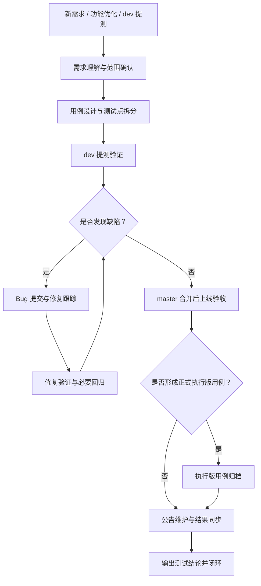

# 功能测试流程

> 面向测试组的分享版主流程。
> 只保留稳定主链路，把细节下沉到子流程和 runbook。

---

## 1. 适用场景

- 新需求测试
- 功能优化测试
- `dev` 提测验证
- 修复后回归验证
- `master` 合并后的上线验收

---

## 2. 流程目标

输出以下结果中的全部或部分：

- 测试结论
- Bug 列表
- 修复验证结论
- 上线验收结论
- 按需归档的执行版测试用例

---

## 3. 标准主链路

1. 需求理解与范围确认
2. 用例设计与测试点拆分
3. `dev` 提测验证
4. Bug 提交与开发中修复跟踪
5. 修复验证与必要回归
6. `master` 合并后上线验收
7. 公告维护与结果同步

按需动作：

- 如果本轮形成了正式执行版用例，且测试验收通过，可追加“执行版测试用例归档”动作

---

## 4. 骨架图

---

## 5. 场景裁剪口径

| 场景 | 需求理解 | 用例设计 | 测试执行 | Bug 跟踪 | 验收结论 |
|------|---------|---------|---------|---------|---------|
| 全新功能 | 完整执行 | 完整执行 | 完整执行 | 严格闭环 | 正式输出 |
| 功能优化 | 完整执行 | 可简化 | 完整执行 | 严格闭环 | 简化输出 |
| Bug 修复 | 聚焦复现与预期 | 通常不单独写新用例 | 聚焦原问题 + 连带点 | 严格闭环 | 备注式输出 |

---

## 6. 每个阶段应调用什么

| 阶段 | 重点问题 | 推荐补读 |
|------|---------|---------|
| 需求理解与范围确认 | 本次到底改了什么 | `../subflows/requirement-and-test-case-design.md` |
| 用例设计与测试点拆分 | 该测什么、怎么测 | `../subflows/requirement-and-test-case-design.md` |
| `dev` 提测验证 | 第一轮先验证哪里 | `../subflows/web-issue-triage.md` |
| Bug 提交与修复跟踪 | 什么时候提单、怎么写 | `../subflows/bug-handoff-and-zentao.md` |
| 修复验证与必要回归 | 修复是否真的通过 | `../subflows/fix-verification.md` |
| 公告维护与结果同步 | 公告怎么维护、结果怎么同步 | `../runbooks/oa-announcement-maintenance.md` |
| 按需执行版用例归档 | 什么情况下归档、归档到哪里 | `../runbooks/seafile-testcase-archival.md` |

---

## 7. 默认收口口径

- 不把“代码已合并”直接等同于“测试已通过”
- 不把“页面看起来正常”直接等同于“业务结果正确”
- 同批次存在追加任务时，应区分：
  - 主任务验证结论
  - 追加任务补充确认结论

---

## 8. 产出最小集

一次功能测试至少建议留住：

- 本轮变更点
- 核心测试点
- Bug 列表
- 修复验证结论
- 是否上线验收通过
- 是否需要归档执行版用例
