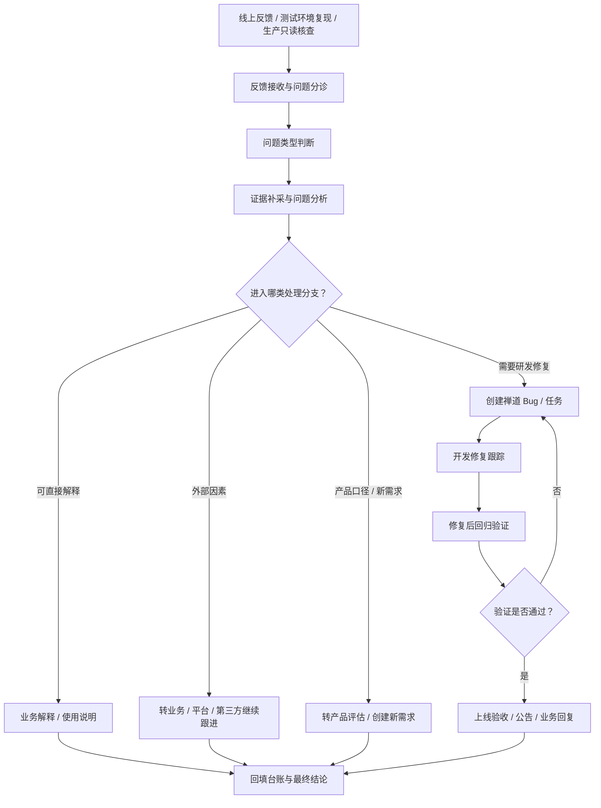

# 线上反馈问题处理流程

> 面向测试组的分享版主流程。
> 本流程的重点不是“所有问题都提 Bug”，而是“把问题分诊后走到正确分支并闭环”。

---

## 1. 适用场景

- 业务群里反馈问题
- 测试环境复现线上现象
- 生产只读核查
- 紧急问题分析
- 功能、性能、平台、数据、链路类排查

---

## 2. 流程目标

输出以下结果中的全部或部分：

- 问题分析结论
- 业务可读回复
- 禅道 Bug / 任务
- 产品新需求
- 修复验证结论
- 上线验收 / 公告结论

---

## 3. 标准主链路

1. 反馈接收与问题分诊
2. 问题类型判断
3. 证据补采与问题分析
4. 进入对应处理分支
5. 在分支处闭环，或进入研发修复链路

---

## 4. 骨架图

---

## 5. 常见分支结束方式

| 结束方式 | 适用场景 | 是否一定提 Bug |
|------|------|------|
| 业务解释后闭环 | 使用方式问题、认知偏差、现状符合规则 | 否 |
| 外部因素转交 | 平台、第三方、权限、环境、配置问题 | 否 |
| 转产品新需求 | 不是缺陷，更像口径缺口或能力缺口 | 否 |
| 研发修复闭环 | 已确认属于系统问题，需要开发改动 | 是 |

---

## 6. 先做什么判断

接到问题后，默认先回答这 4 个问题：

1. 当前到底是什么现象
2. 属于哪一类问题：Web / 功能 / 性能 / 平台 / 数据 / 链路
3. 现有证据够不够下结论
4. 当前应该在哪个分支结束，还是继续进入研发修复链路

---

## 7. 每个阶段应调用什么

| 阶段 | 重点问题 | 推荐补读 |
|------|---------|---------|
| 反馈接收与问题分诊 | 要不要进统一台账、怎么回填最小信息 | `../runbooks/issue-board-update.md` |
| 问题类型判断 | 当前先往哪层查 | `../subflows/web-issue-triage.md` |
| 证据补采与问题分析 | 该看页面、接口、日志还是数据 | `../subflows/web-issue-triage.md` |
| 创建禅道 Bug / 任务 | 哪些问题应该研发闭环 | `../subflows/bug-handoff-and-zentao.md` |
| 修复后回归验证 | 修复是否真的有效 | `../subflows/fix-verification.md` |
| 业务结论同步 | 群里应该怎么说 | `../subflows/business-feedback-response.md` |

---

## 8. 默认执行口径

- 不把“创建 Bug / 关闭 Bug”视为唯一收口方式
- 不把“当前怀疑”直接写成“已确认原因”
- 需要对外同步时，优先输出：
  - 当前现状
  - 直接依据
  - 推测
  - 下一步

---

## 9. 产出最小集

一次线上反馈处理至少建议留住：

- 问题现象
- 问题分类
- 关键证据
- 当前结论
- 下一步或责任归属
- 是否需要研发闭环
